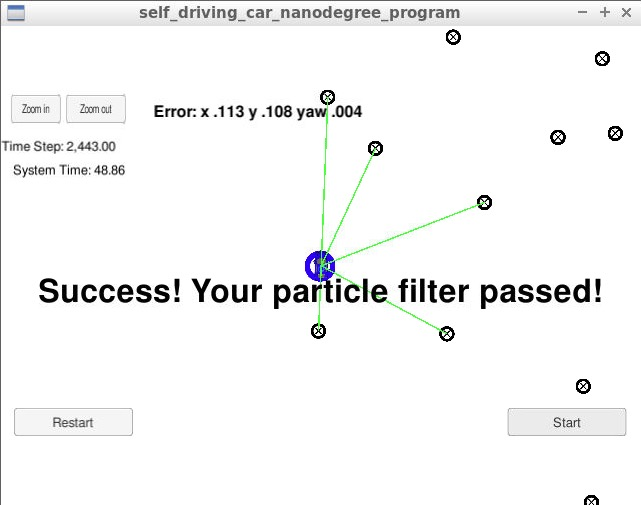
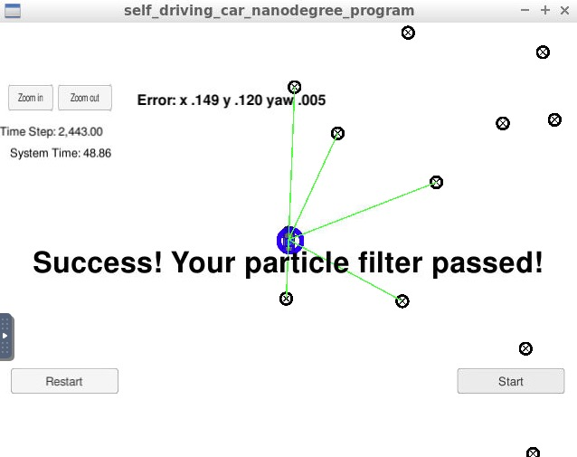
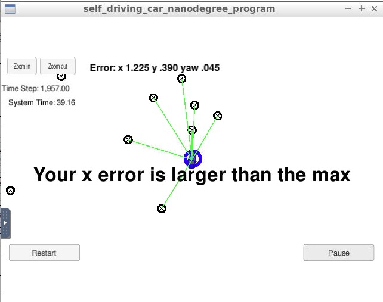

# Overview
This repository contains all the code needed to complete the final project for the Localization course in Udacity's Self-Driving Car Nanodegree.

# Project Introduction
Your robot has been kidnapped and transported to a new location! Luckily it has a map of this location, a (noisy) GPS estimate of its initial location, and lots of (noisy) sensor and control data.

In this project you will implement a 2 dimensional particle filter in C++. Your particle filter will be given a map and some initial localization information (analogous to what a GPS would provide). At each time step your filter will also get observation and control data.

# Running the Code
The main program can be built and ran by using some scripts have been included to streamline this process, these can be leveraged by executing the following in the top directory of the project:

1. ./clean.sh
2. ./build.sh
3. ./run.sh

Here is the main protocol that main.cpp uses for uWebSocketIO in communicating with the simulator.

## INPUT: values provided by the simulator to the c++ program
// sense noisy position data from the simulator
["sense_x"]
["sense_y"]
["sense_theta"]

// get the previous velocity and yaw rate to predict the particle's transitioned state
["previous_velocity"]
["previous_yawrate"]

// receive noisy observation data from the simulator, in a respective list of x/y values
["sense_observations_x"]
["sense_observations_y"]


## OUTPUT: values provided by the c++ program to the simulator

// best particle values used for calculating the error evaluation
["best_particle_x"]
["best_particle_y"]
["best_particle_theta"]

//Optional message data used for debugging particle's sensing and associations

// for respective (x,y) sensed positions ID label
["best_particle_associations"]

// for respective (x,y) sensed positions
["best_particle_sense_x"] <= list of sensed x positions
["best_particle_sense_y"] <= list of sensed y positions

# Implementing the Particle Filter
The directory structure of this repository is as follows:

```
root
|   build.sh
|   clean.sh
|   CMakeLists.txt
|   README.md
|   run.sh
|
|___data
|   |   
|   |   map_data.txt
|   
|   
|___src
    |   helper_functions.h
    |   main.cpp
    |   map.h
    |   particle_filter.cpp
    |   particle_filter.h
```

I implemented all functions defined in particle_filter.cpp/h and modified parameters for dataAssociation function in particle fileter to include sense_range value to filter potential landmark.

## Inputs to the Particle Filter
You can find the inputs to the particle filter in the `data` directory.

### The Map*
`map_data.txt` includes the position of landmarks (in meters) on an arbitrary Cartesian coordinate system. Each row has three columns
1. x position
2. y position
3. landmark id

### All other data the simulator provides, such as observations and controls.

> * Map data provided by 3D Mapping Solutions GmbH.

# Project output
Initial number of particle filter was set as 100, and it passed simulation successfully.
As far as tried several times down to 10, the simulation was successfully completed.

Result for # of particle = 100


Result for # of particle = 10


Result for # of particle = 5



